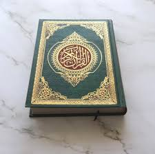

# Je suis un titre de niveau 1
---------------
## Moi par contre je suis un titre de niveau 2
-------------------------------
__Texte en gras__

*Texte en italique*

Je tape du texte et je voudrais  
revenir à la ligne

## Faire une liste à puce :

* élément 1
* élément 2
* élément 3

## Faire une liste ordonnée :
1. élément 1
2. élément 2
3. élément 3

## Faire une imbrication de puce :
* élément 1
    * sous-élément 1
    * sous-élément 2

>Je suis une citation

`Je suis un bout de code`

## Mettre un lien dans le readme :
Mon site [ici](https://www.inphb.ci)

Mettre une image, un logo : 
